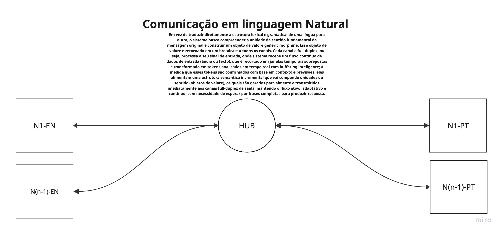

# Sistema de Dublagem em Tempo Real

## Motivação do Projeto

Após horas navegando pelo YouTube, enfrentando anúncios repetitivos de cursos de inglês para desenvolvedores, percebi que a verdadeira linguagem que importa para esse público é aquela que *compila sem warnings*. Inspirado por essa frustração e por conhecimentos de sistemas distribuídos adquiridos na faculdade, decidi criar uma solução inovadora. Assim nasceu a primeira versão deste sistema, ainda em fase de testes, mas com potencial para transformar a comunicação global. A proposta é ousada: desenvolver uma ferramenta descentralizada para comunicação em múltiplos idiomas, que, acredito, teria o aval de Andrew Tanenbaum.

### O que é o projeto?

Este projeto propõe um sistema de dublagem em tempo real, distribuído e full-duplex, que permite diálogos naturais entre falantes de diferentes idiomas **sem depender de tradução literal**. Em vez disso, o sistema cria uma **linguagem intermediária universal** baseada em **morfismos linguísticos** e estruturas formais, reconstruindo a fala no idioma de destino com fidelidade semântica e morfológica.

Diferentemente dos sistemas tradicionais de dublagem, que mapeiam palavras diretamente, este framework imita o processamento humano da linguagem: organizamos pensamentos em tempo real, usando o idioma como uma representação de uma estrutura universal subjacente. Aqui, a linguagem é tratada como uma **estrutura composicional universal**, enquanto os idiomas são **instanciações locais** dessa estrutura, formalizadas por gramáticas categóricas.

O sistema rompe com o paradigma da tradução palavra por palavra, utilizando **morfismos** — transformações semânticas que preservam significado — para mapear a entrada linguística em uma representação intermediária, que é então projetada no idioma de saída.

---

## Arquitetura e Design

### Visão Geral

A arquitetura é composta por **canais full-duplex** que processam entrada e saída de áudio em tempo real, um **barramento** temporário para multiplexação de dados, e uma camada de **morfismos linguísticos** que encapsula a lógica semântica. A figura abaixo ilustra a estrutura inicial:



> *Alt text: Diagrama representando canais full-duplex conectados por um barramento temporário, com planos de migrar para uma arquitetura serverless no futuro.*

### Canais (C)

Os canais são os componentes principais, responsáveis por codificar e decodificar informações linguísticas. Cada canal opera de forma independente, processando áudio em tempo real e gerando um **objeto mórfico** — uma estrutura de dados que encapsula transformações semânticas.

- **Objeto Mórfico**: Em vez de chamar o objeto de "homomórfico" (que implica uma preservação de estrutura específica em teoria das categorias), optamos por "mórfico", refletindo sua função como um portador de transformações semânticas. Esse objeto contém:
  - **Instruções semânticas**: Representações composicionais de significado, baseadas em morfismos derivados de uma gramática categorial.
  - **Metadados morfológicos**: Informações sobre flexões (gênero, número, tempo) necessárias para reconstrução no idioma de saída.
  - **Contexto prosódico**: Dados sobre entonação e ritmo para garantir naturalidade na dublagem.

Atualmente, o sistema suporta dois canais:
- **PT-BR** (Português do Brasil)
- **EN** (Inglês)

Cada canal possui:
- **Entrada**: Captura áudio via microfone, processando-o em tempo real com reconhecimento de fala (ASR).
- **Saída**: Gera áudio no idioma de destino, usando síntese de voz (TTS). Em desenvolvimento, um driver de áudio virtual permitirá integração com plataformas como Google Meet.

---

### Barramento (B)

O barramento é uma estrutura temporária que multiplexa os objetos mórficos entre os canais. Ele gerencia o fluxo de dados, mas carece de sincronização robusta, sendo um ponto de melhoria.

**Plano Futuro**: Migrar para uma arquitetura **serverless** em **Kubernetes (K8s)**, onde cada canal será um microserviço independente. Isso eliminará o barramento, permitindo comunicação direta entre canais via APIs assíncronas, com maior escalabilidade e resiliência.

---

### Camada de Morfismos

A inovação central é a **camada de morfismos**, que opera como uma rede neural morfossintática (RNM), integrada com um autômato mórfico (AM) e uma gramática de produção mórfica (GPM), conforme discutido anteriormente:

- **Rede Neural Morfossintática (RNM)**: Transforma a entrada linguística (áudio ou texto) em morfismos parciais, representando transformações semânticas. Usa embeddings contextuais (inspirados em BERT) para capturar significado.
- **Autômato Mórfico (AM)**: Navega pela estrutura gramatical, decidindo como compor os morfismos (ex.: \( g \circ f \)). Funciona como um parser semântico dinâmico.
- **Gramática de Produção Mórfica (GPM)**: Define regras categóricas, como \( f: A \to B, g: B \to C \implies g \circ f: A \to C \), garantindo composições válidas.

Essa camada cria a linguagem intermediária universal, mapeando a entrada para uma representação abstrata antes de projetá-la no idioma de saída.

---

## Como Utilizar

O sistema é uma **prova de conceito (POC)**. Para executá-lo localmente:

```bash
docker-compose up --build
```

Isso inicia o sistema, que converte áudio em português para inglês em tempo real. Requisitos:
- Docker instalado.
- Microfone funcional.

---

## Correções e Refinamentos Conceituais

1. **Terminologia: Objeto Mórfico**:
   - O termo "objeto homomórfico" foi substituído por "objeto mórfico", pois "homomorfismo" implica uma preservação de estrutura específica (como em álgebra). Morfismos, na teoria das categorias, são mais gerais, adequando-se à ideia de transformações semânticas.
   - O objeto mórfico agora é descrito com maior clareza, incluindo instruções semânticas, metadados morfológicos e contexto prosódico.

2. **Linguagem Intermediária Universal**:
   - Reforçada a ideia de que a linguagem intermediária é uma estrutura composicional, baseada em morfismos e gramáticas categóricas, alinhando-se com frameworks como DisCoCat [Mathematical Foundations for a Compositional Distributional Model of Meaning](https://arxiv.org/abs/1003.4394).
   - Esclarecido que a abordagem evita tradução literal, focando em transformações semânticas.

3. **Integração com Conceitos do Chat**:
   - Incorporada a arquitetura de RNM, AM e GPM, detalhando como a camada de morfismos opera como uma rede neural que aprende a compor significados, não apenas prever palavras.
   - Reforçada a conexão com gramáticas categóricas e o cálculo lambda para composição semântica.

4. **Barramento e Escalabilidade**:
   - Clarificado que o barramento é temporário e será substituído por uma arquitetura serverless, com microserviços em K8s, aumentando a escalabilidade.
   - Adicionado o plano de usar APIs assíncronas para comunicação direta entre canais.

5. **Notas Futuras**:
   - Incluída a possibilidade de criar linguagens artificiais, usando gramáticas formais (como as de Chomsky) para gerar sequências decodificáveis, com morfismos derivativos como terminais ou não-terminais.
   - Especificado que a retropropagação na rede neural será calibrada com base na coerência das sequências geradas, alinhando-se com a ideia de interpretabilidade.

---

## Notas Finais

Este projeto é uma semente com potencial para revolucionar a comunicação global. Embora esteja em fase inicial, a combinação de morfismos linguísticos, redes neurais e gramáticas categóricas abre portas para aplicações como tradução semântica, dublagem em tempo real e criação de linguagens artificiais. As próximas etapas incluem testes mais robustos, integração com plataformas de videoconferência e expansão para novos idiomas.

## Futuro para Não Esquecer

Planejamos implementar:
- **Driver de áudio virtual** para integração com plataformas como Google Meet.
- **Personalização de voz**, replicando a voz do falante na saída, usando técnicas de clonagem vocal.
- **Rede social global**, permitindo que falantes de idiomas menos representados criem canais personalizados.
- **Criação de linguagens artificiais**: Usar gramáticas formais (como as de Chomsky) para gerar linguagens decodificáveis, com morfismos derivativos como terminais ou não-terminais. A retropropagação será calibrada para garantir coerência semântica, permitindo que a rede aprenda a compor significados de forma interpretável.
